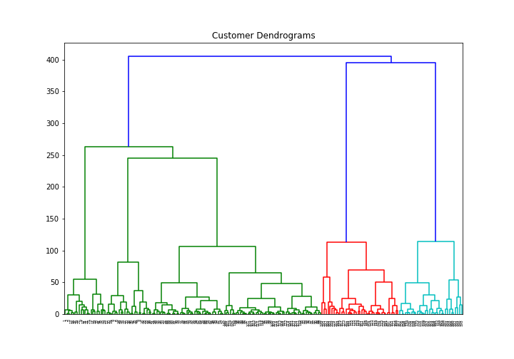
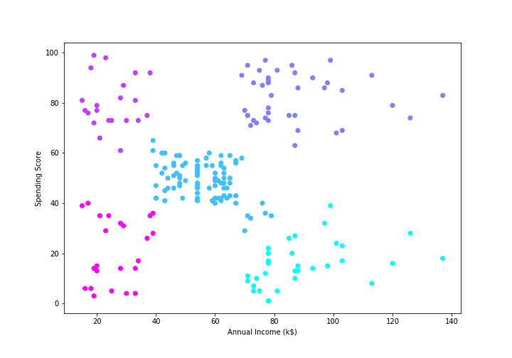

# Shopping Trends

Segment customers into different groups based on their shopping trends. This can be used target the right ones which can help to increase the customers and hence make profits.

## Goal

Use ***Agglomerative* Hierarchical Clustering** algorithm for the customer segmentation.

## Background  

### Hierarchical clustering  

* A type of ***unsupervised machine learning algorithm*** used to ***cluster unlabeled data points***.
* Groups together the data points with similar characteristics.  
* There are two types of hierarchical clustering:  
  * **Agglomerative**: Data points are clustered using a *bottom-up approach* starting with individual data points.
  * **Divisive**: A *top-down approach* is followed where all the data points are treated as one big cluster and the clustering process involves dividing the one big cluster into several small clusters.

### Agglomerative approach

* Treat each data point as one cluster
* Form a cluster by joining the two closest data points resulting in K-1 clusters.
* Measure the distance between two clusters using any method:
  * Distance between the closest points of two clusters.
  * Distance between the farthest points of two clusters.
  * Distance between the centroids of two clusters.
  * Mean of the sum of the distance between all possible combination of points between the two clusters.
* Form more clusters by joining the two closest clusters resulting in K-2 clusters.
* Repeat the above steps until one big cluster is formed.
* Once a single cluster is formed, **Dendrograms** are used to divide into multiple clusters depending upon the problem.  

---

## Dependencies

* Pandas
* Matplotlib
* Scikit-learn

`pip install -r requirements.txt`

## Dataset

Customer shopping data saved in: *data/shopping_data.csv*

Features:

1. CustomerID
2. Genre
3. Age
4. Annual Income (k$)
5. Spending Score (1-100): The score given to a customer, based on the money spent and the behavior of the customer.

## Data Preprocessing

To view result in 2D feature space, retain only two of the five features:

* Annual Income (k$)
* Spending Score (1-100)

## Know the number of clusters

* Create ***Dendrograms*** for the data
  * *linkage* method-> minimize distancess as parameters
    * *ward* -> minimizes the variants of distances between clusters
  * *dendrogram* method-> Create dendrograms
* Get the number of clusters by *drawing a horizontal line that passes through longest distance without a horizontal line*

## Group the data points into clusters

* Use **agglomerative clustering**
* Obtain the labels for the data points
* Plot the points

## Inference

* Data points form five clusters.  
* Data points in the *bottom right* belong to the customers with *high salaries but low spending*.  
  * They spend their money carefully.  
  * Not worth targetting.
* Data points in the *top right* belong yo customers with *high salaries and high spending*.  
  * These are the customers to be targetted.  
* Data points in the middle are the for the ones with *average income and average spending*.  
  * The *highest numbers of customers* belong to this category.  
  * These customers can be targetted given the fact that they are in huge numbers.
* Data points to the *top left* are *very few* even if they are for customers with *high spending*.
  * Not worth targetting.
* Data points to the *bottom left* are for those with *low spending score*.
  * Not worth targetting.

## Conclusion

* Most of the data in the real-world is unlabeled and annotating the data has higher cost.
* The clustering technique is very handy for unlabeled data.  
* Hierarchical clustering is a method to cluster unlabeled data.  
